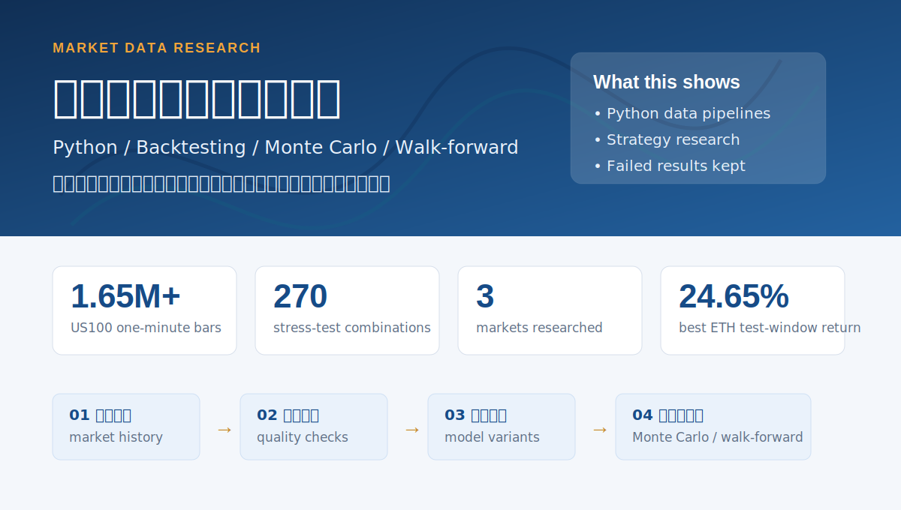

# Finance Analytics Portfolio

This repository is a small collection of market-data research notes and result artifacts.

The goal is not to prove that a strategy is profitable. The goal is to document how I collected data, cleaned it, tested assumptions, compared variants, and rejected results that did not survive basic validation.

Most of the work here came from one problem I kept running into: a backtest can look good in one period, but still fail once costs, drawdown, out-of-sample behavior, or walk-forward checks are added.

## Scope

What this repo covers:

- historical market-data cleaning
- Python backtesting and parameter comparison
- simple filter / regime experiments
- transaction-cost and drawdown checks
- Monte Carlo and walk-forward validation
- result tables and chart exports

What this repo does not claim:

- no live-trading recommendation
- no financial advice
- no claim that any strategy is production-ready
- no claim that historical return numbers can be repeated

## Research Cases

| Case | Data | Method | Main result | Current limitation |
|---|---|---|---|---|
| ETHUSDT Hurst / HMM filter comparison | Bybit ETHUSDT perpetual, 2024-05-26 to 2026-05-26 | Python backtest, Hurst filters, lightweight HMM proxy | Best Hurst variant returned 24.65% with -8.10% max drawdown in the test window | Needs more markets and longer out-of-sample checks |
| US100 data pipeline and stress test | Dukascopy USATECH.IDX/USD one-minute bars, 2021-05-28 to 2026-05-27 | data-quality checks, 70/30 split, cost stress, Monte Carlo, walk-forward | 8 selected candidates failed under strict stress conditions | Useful as a rejection process, not as a tradable setup |
| XAUUSD robustness check | Dukascopy XAUUSD mid OHLC, 2021-05-28 to 2026-05-28 | full-sample backtest, cost stress, Monte Carlo, walk-forward | full-sample candidates looked strong, but walk-forward results were weak | Strong example of overfitting risk |

## Data and Validation Notes

The US100 case is the cleanest example of the data workflow:

| Check | Result |
|---|---:|
| Total one-minute bars checked | 1,650,628 |
| Duplicate open times | 0 |
| Abnormal OHLC rows | 0 |
| Missing one-minute ratio | 37.23% |
| Gap segments | 1,452 |
| Parameter / stress combinations | 270 |

The high missing-minute ratio is kept in the notes because it affects how much confidence I should place in any result. I did not want the repo to only show final curves without the data-quality problems behind them.

## Why Failed Results Are Included

Some results in this repository are intentionally negative.

For example, the US100 candidates were selected from training-period performance, then tested under stricter assumptions. All 8 failed the strict stress classification. I kept this result because it is more useful than hiding it:

- it shows that selection-period performance is not enough
- it helps avoid overconfidence from a good-looking equity curve
- it makes the assumptions and rejection process visible

## Repository Structure

```text
.
├── README.md                  # overview and research summary
├── CASE_STUDY.md              # detailed notes for each case
├── source-files.md            # data/artifact notes
├── index.html                 # static portfolio page
├── styles.css                 # page styling
├── assets/                    # exported charts and overview images
└── data/                      # selected CSV result tables
```

## Selected Artifacts

| Path | Description |
|---|---|
| `CASE_STUDY.md` | detailed write-up with setup, results, and limitations |
| `data/summary.csv` | compact summary of the three main cases |
| `data/eth-hurst-hmm-top30.csv` | top ETHUSDT filter variants |
| `data/us100-walk-forward.csv` | US100 walk-forward sample |
| `data/xauusd-top-stability.csv` | XAUUSD stability-ranked candidates |
| `assets/eth-hurst-hmm-equity.svg` | ETHUSDT equity-curve comparison |
| `assets/xauusd-cisd-equity.svg` | XAUUSD equity-curve comparison |

## Visual Summary

The image below is only a visual summary for non-technical review. The actual assumptions and limitations are in `CASE_STUDY.md`.



## What I Would Improve Next

- add a clean CLI runner for each experiment
- move experiment settings into config files
- add unit tests for PnL, drawdown, and fee accounting
- separate raw data handling from report artifacts
- generate result charts directly from scripts

## Notes

This is a research and documentation portfolio. All results are historical tests and should be treated as examples of analysis workflow, not as trading advice.
