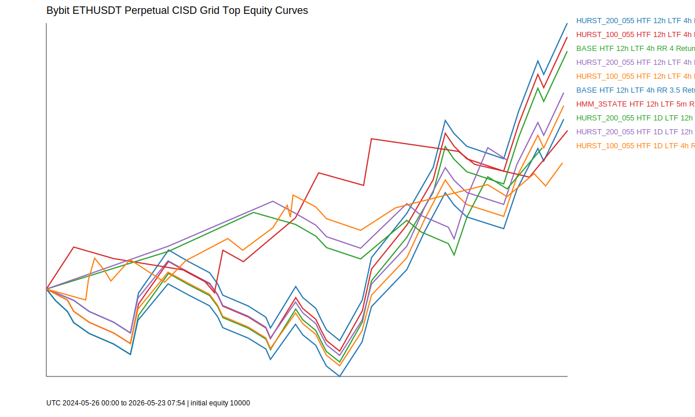
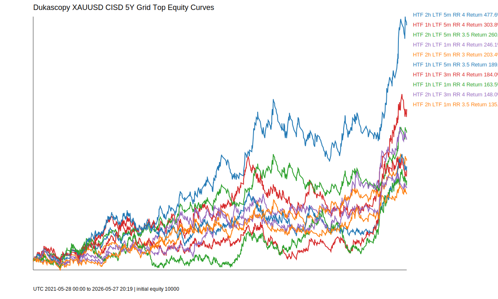

# 金融市場資料分析作品報告

## 作品定位

我原本的學習背景偏向生醫領域，訓練過程重視觀察、證據、變因控制與資料判讀。接觸金融市場後，我發現經濟與市場決策同樣需要用資料驗證假設，而不是只憑直覺判斷。因此，我開始用 Python 整理市場資料、建立回測流程，並用壓力測試與樣本外驗證檢查策略是否穩定。

這份報告不是為了證明我「會交易」，而是展示我如何面對不確定資料、建立模型、比較結果，並用風險意識檢查結論。

## 摘要表

| 案例 | 資料期間 | 方法 | 主要結果 | 我的收穫 |
|---|---:|---|---|---|
| ETHUSDT Hurst/HMM 濾網 | 2024-05-26 至 2026-05-26 | 多週期回測、Hurst、HMM proxy | 最佳 HURST_200_055 組合報酬 24.65%，最大回撤 -8.10% | 濾網可改善部分結果，但仍要防止過度最佳化 |
| US100 嚴格壓力測試 | 2025-05-28 至 2026-05-28 | 70/30 split、成本壓力、Monte Carlo | 多數候選在重成本壓力下 FAIL | 失敗結果也有價值，能幫助淘汰不穩定模型 |
| XAUUSD 五年壓力測試 | 2021-05-28 至 2026-05-28 | 全樣本、walk-forward、成本壓力 | 全樣本有高報酬候選，但 walk-forward 表現不穩 | 不能只看漂亮的全樣本績效 |

## 案例一：ETHUSDT 策略回測與濾網研究

### 研究問題

如果在基本策略上加入趨勢或 regime 濾網，是否能改善報酬或降低回撤？

### 方法

| 項目 | 設定 |
|---|---|
| 市場 | Bybit ETHUSDT perpetual |
| 期間 | 2024-05-26 至 2026-05-26 |
| 風險 | 每筆 1% |
| 成本 | 手續費 0.055% per side |
| 濾網 | BASE、HURST_100_055、HURST_200_055、HMM_2STATE、HMM_3STATE |
| 比較 | HTF/LTF 多週期組合、RR 2 至 4 |

### 前十名摘要

| Rank | Filter | HTF | LTF | RR | Return | Max DD | Trades |
|---:|---|---|---|---:|---:|---:|---:|
| 1 | HURST_200_055 | 12h | 4h | 4.0 | 24.65% | -8.10% | 31 |
| 2 | HURST_100_055 | 12h | 4h | 4.0 | 23.37% | -8.10% | 32 |
| 3 | BASE | 12h | 4h | 4.0 | 22.05% | -8.10% | 33 |
| 7 | HMM_3STATE | 12h | 5m | 4.0 | 14.70% | -4.07% | 15 |

### 小結

Hurst 濾網在這次測試中提高了最佳組合的報酬，HMM proxy 則明顯減少交易次數並降低部分回撤。這讓我理解到：模型不是越複雜越好，而是要看它是否能在風險與交易機會之間取得合理平衡。

## 案例二：US100 資料清理與嚴格壓力測試

### 資料工程

我使用 Python 從 Dukascopy 下載 US100 一分鐘資料，並檢查資料完整性。

| 項目 | 結果 |
|---|---:|
| 資料期間 | 2021-05-28 至 2026-05-27 |
| 總 bars | 1,650,628 |
| 重複時間 | 0 |
| 異常 OHLC | 0 |
| 缺漏比例 | 37.23% |
| gap segments | 1,452 |

### 壓力測試設計

| 項目 | 設定 |
|---|---|
| 市場 | Dukascopy USATECH.IDX/USD |
| 測試期間 | 2025-05-28 至 2026-05-28 |
| 組合數 | 270 |
| 選擇方式 | 70/30 split，訓練期選 top return / top calmar / stability |
| 成本假設 | spread、slippage、commission，並測 1.5x / 2x / 3x |
| 驗證 | Monte Carlo、walk-forward、成本壓力 |

### 結果摘要

| 指標 | 結果 |
|---|---|
| 選出候選 | 8 |
| 壓力測試分類 | 全部 FAIL |
| walk-forward segments | 6 |
| 正報酬 segments | 2 / 6 |
| 平均 OOS return | 0.30% |
| 最差 segment | -6.41% |

### 小結

這個案例的重要性不在於找到高報酬策略，而是建立「不通過也要如實記錄」的研究習慣。對經濟與金融分析來說，避免被漂亮績效誤導，比追求單一最佳結果更重要。

## 案例三：XAUUSD 五年策略穩定性檢查

### 方法

| 項目 | 設定 |
|---|---|
| 市場 | Dukascopy XAUUSD mid OHLC |
| 期間 | 2021-05-28 至 2026-05-28 |
| 策略 | HTF Liquidity Sweep + LTF CISD 50% Limit Entry |
| 驗證 | 全樣本、成本壓力、Monte Carlo、walk-forward |

### 全樣本候選

| HTF -> LTF | RR | Return | Max DD | Trades | Grade |
|---|---:|---:|---:|---:|---|
| 2h -> 5m | 4.0 | 477.56% | -29.48% | 806 | B |
| 2h -> 1m | 4.0 | 246.10% | -22.83% | 955 | C |
| 2h -> 5m | 3.5 | 260.19% | -26.74% | 819 | C |

### 風險判斷

全樣本結果看起來亮眼，但 walk-forward 報告顯示：

| 測試 | 結果 |
|---|---:|
| 3m/1m segments | 57 |
| 3m/1m positive ratio | 45.61% |
| 3m/1m total sum | -8.64% |
| 6m/1m segments | 54 |
| 6m/1m positive ratio | 57.41% |
| 6m/1m total sum | -14.78% |

### 小結

這個案例提醒我，金融資料分析不能只看全樣本最佳化結果。若樣本外或 walk-forward 不穩定，就必須保留疑問，不能直接下過度樂觀的結論。

## 對經濟系申請的連結

| 經濟系能力 | 對應作品證據 |
|---|---|
| 統計與資料判讀 | 多市場 CSV、缺漏檢查、績效表格 |
| 風險與不確定性 | 最大回撤、Monte Carlo、成本壓力 |
| 模型比較 | BASE、Hurst、HMM proxy、不同 RR 與時間週期 |
| 經濟與金融市場理解 | ETH、US100、XAUUSD 多市場分析 |
| 自主學習能力 | Python 腳本、Qlib / LightGBM、TradingView 工具串接 |

## 結論

這些作品讓我理解到，市場分析不是追求單一漂亮數字，而是建立一套能被檢查的研究流程：先取得資料，再清理資料，接著建立假設與模型，最後用壓力測試、成本假設與樣本外驗證檢查結論。這樣的訓練讓我更想進入經濟學系，系統性學習個體經濟、總體經濟、統計、計量經濟與金融市場，讓未來的分析不只停留在技術操作，而能連結更完整的經濟理論與決策框架。

## 附註

本報告為學習與書審展示用途，不構成投資建議。
